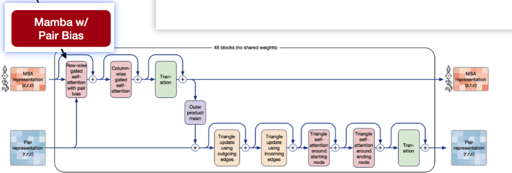
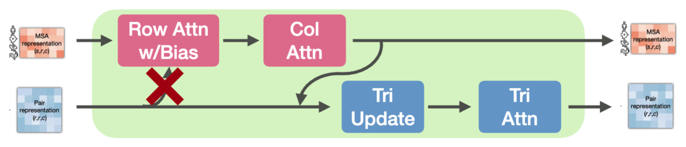
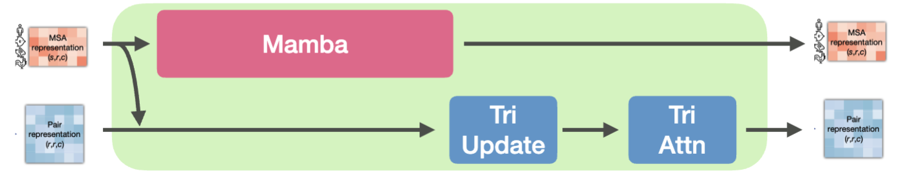
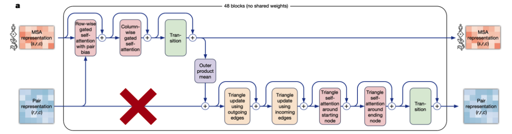
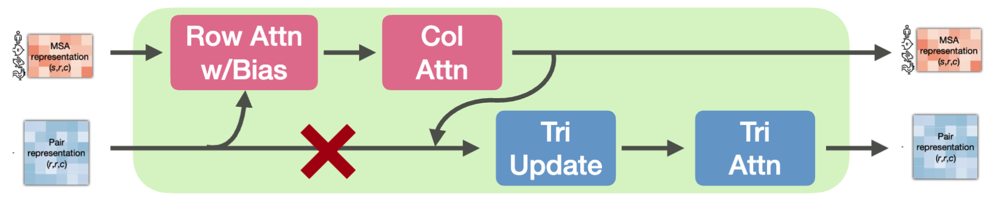
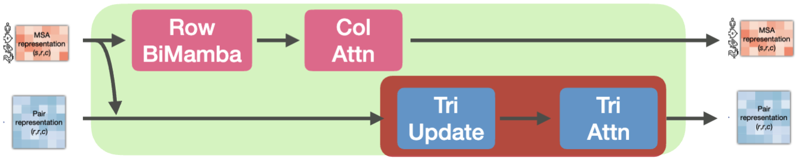
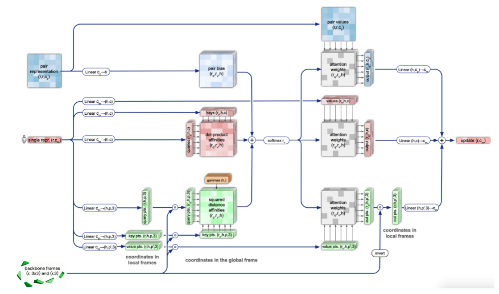
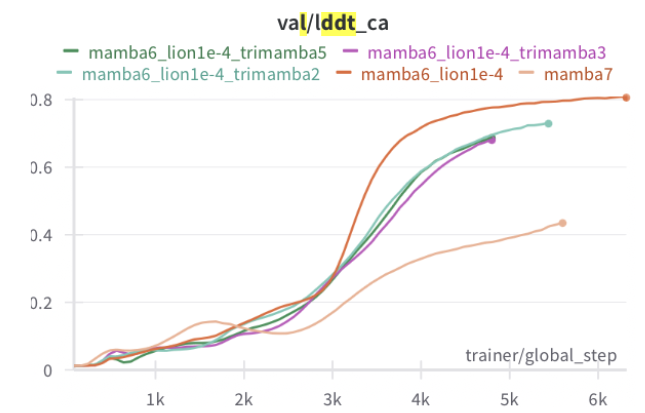
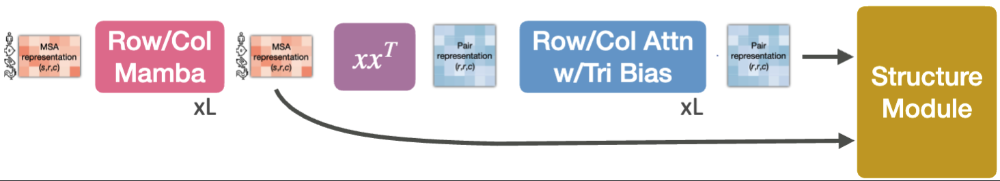
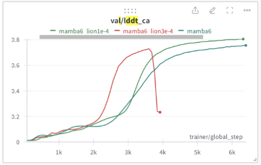

# MSA Stream

Here we tried to accelerate the MSA stream.
All results are on the CAMEO dataset.

## Slide 23: Row Attention → Mamba

**Context:** Replacing row-wise attention with Mamba with a pair bias.

| Model | Pair Bias | LDDT_CA | GDT_TS |
|-------|-----------|---------|--------|
| Mamba | Y | 0.77 | 0.59 |
| AF | Y | 0.78 | 0.61 |

**Conclusion:** Mamba performs as well as attention with a pair bias.

## Slide 29: Removing Pair Bias

**Context:** Testing the importance of pair bias in attention mechanisms, particularly comparing AlphaFold vs. MambaFold sensitivity.

| Model | Inference Change | LDDT_CA | GDT_TS |
|-------|------------------|---------|--------|
| AF | No Pair Bias | 0.38 | 0.22 |
| RowMambaWithPairBias | No Pair Bias | 0.76 | 0.58 |
| RowMambaWithPairBias | N/A | 0.77 | 0.59 |

**Conclusion:** Mamba, even without the pair bias derived from the pair representation, is a surprisingly strong replacement for row-wise attention.

## Slide 41: Merge Row/Col

**Context:** Attempting to combine row and column operations into a single joint operation for efficiency.

| Configuration | LDDT_CA | GDT_TS | Train Time |
|---------------|---------|--------|------------|
| Row Mamba - Col Attn | 0.77 | 0.59 | 2.5d |
| Mamba Combined | 0.71 (-0.06) | 0.51 (-0.08) | 3d |

**Conclusion:** Column attention seems to be better than column mamba.

# Pair Stream

## Row 69-71: Triangle Attention Ablations

Might be inference only.

| Configuration | LDDT_CA | GDT_TS |
|---------------|---------|--------|
| No Triangle Bias | 0.24 | 0.03 |
| No Triangle Attention | 0.36 | 0.25 |
| Baseline | 0.78 | 0.61 |

## Slide 20: Shallow Pair Representation

**Context:** Testing if pair representation can be derived directly from MSA without deep pair processing. Note that the relative Positional Embedding is missing.

| Configuration | LDDT_CA | GDT_TS |
|---------------|---------|--------|
| Pair from MSA | 0.69 | 0.49 |
| Baseline | 0.78 | 0.61 |

**Conclusion:** A deep pair representation is necessary for good performance. Cannot compute on the fly.

## Slide 28: Trying to Remove Pair Representation

**Context:** Similar to the previous experiment, except with positional embedding.

| Configuration | Rel Pos Emb | LDDT_CA | GDT_TS |
|---------------|-------------|---------|--------|
| No residual | n | 0.69 | 0.49 |
| + pos embed + OPM w/LN | y | 0.73 | 0.53 |
| Baseline | y | 0.78 | 0.61 |

**Conclusion:** The relative positional embedding is pretty important, though not sufficient.

## Slide 42: Simplify Pair Branch

**Context:** Systematic ablation of triangle operations to understand their necessity.

| Tri Update | Tri Attn | LDDT_CA | GDT_TS | Train Time |
|------------|----------|---------|--------|------------|
| Y | Y | 0.77 | 0.59 | 2.5d |
| N | Y | 0.77 | 0.59 | 2d |
| Y | N | 0.74 | 0.54 | 2d |
| N | N | 0.35* | 0.06 | 1.2d |

**Conclusion:** Triangle attention is more critical than triangle updates. Removing both causes catastrophic performance loss.

## Slide 45: Invariant Point Attention (IPA)

**Context:** Testing which components of the pair representation are essential for the structure module.

| Model | Inference | LDDT_CA | GDT_TS |
|-------|-----------|---------|--------|
| Mamba3 | N/A | 0.77 | 0.59 |
| Mamba3 | No Pair Bias | **0.76** | **0.58** |
| Mamba3 | No Pair Values | 0.06 | 0.05 |
| AF (long) | N/A | 0.89 | 0.75 |
| AF (long) | No Pair Bias | 0.11 | 0.02 |
| AF (long) | No Pair Values | 0.42 | 0.46 |

**Key Findings:** 
- Pair Values are critical for structure prediction
- Mamba is more robust to removing pair bias than AlphaFold

## Slide 60: Mambify Triangle v2
**Context:** Attempting to replace triangle attention with Mamba-based operations.

**Conclusion:** Triangle attention is hard to beat.

## Slide 68: SplitFormer Architecture

**Context:** Separating MSA processing from pair processing to improve training efficiency and modularity.

| Layers | Runtime | LDDT-CA | GDT-TS |
|--------|---------|---------|--------|
| Joint MSA+Pair | 48hr | 0.77 | 0.59 |
| MSA then Triangle | 42hr | 0.78 | 0.60 |

**Conclusion:** Sequential processing is both faster (42hr vs 48hr) and slightly more accurate, suggesting the operations can be effectively decoupled. Note that the speedup is purely from low-level optimizations, since the number of each layer is the same. The Evoformer is less efficient in its internal memory management.

# Misc

## Slide 53: LIONify (Optimizer Comparison)

**Context:** Testing the LION optimizer as an alternative to AdamW for training efficiency.

| Optimizer | LR | LDDT_CA | GDT_TS | Steps |
|-----------|----|---------|---------| ------|
| AdamW | 1E-03 | 0.77 | 0.59 | 7000 |
| Lion | 3E-03 | NaN | - | - |
| Lion | 1E-04 | **0.81** | **0.63** | 6300 |

**Key Finding:** LION optimizer with proper learning rate (1E-04) achieves better performance in fewer steps than AdamW.
